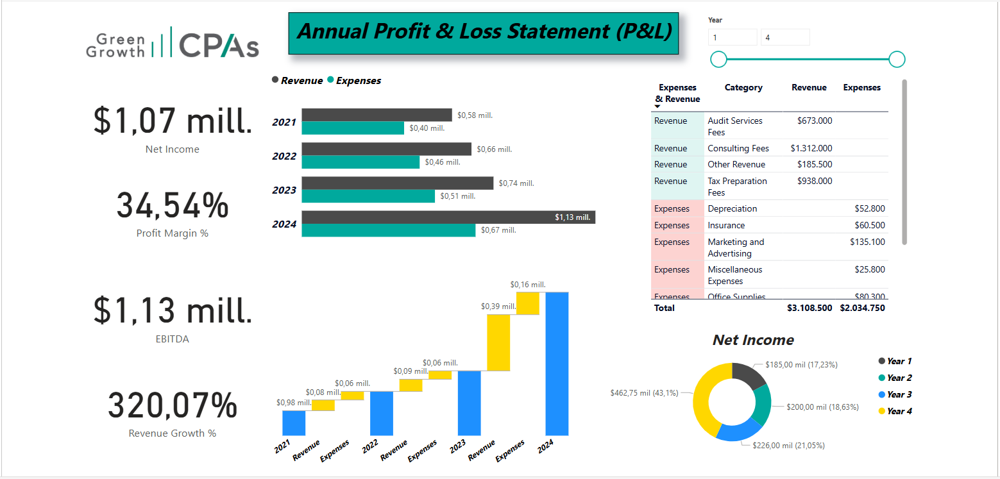
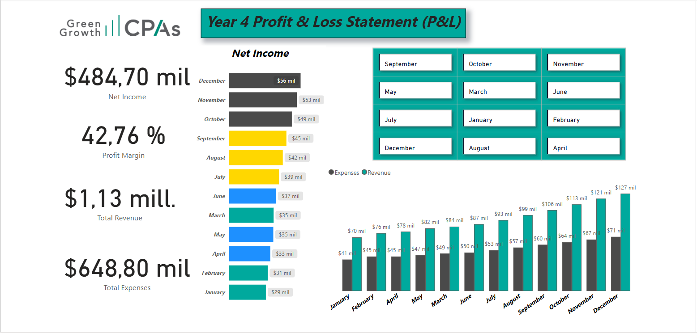

# Financial Insights Dashboards with Power BI

## Introduction
This project presents two dynamic dashboards created in Power BI: **Annual Profit & Loss Statement** and **Year 4 Profit & Loss Statement (P&L)**. These dashboards provide insights into overall financial performance and a detailed analysis of Year 4's results. By leveraging interactive visualizations and key metrics, the dashboards allow for deeper exploration of financial data.

---

## Dashboard 1: **Annual Profit & Loss Statement**
This dashboard provides an overview of financial performance across multiple years (2021–2024), highlighting key metrics and trends.

### Key Features:
- **KPI Cards:**
  - Net Income
  - Profit Margin
  - EBITDA
  - Revenue Growth
- **Visualizations:**
  - Grouped Bar Chart: Displays Revenue and Expenses for the years 2021, 2022, 2023, and 2024.
  - Waterfall Chart: Breaks down Revenue and Expenses by year to show financial changes clearly.
  - Table: Provides a detailed breakdown of categories for Expenses and Revenues, along with totals for each.
  - Donut Chart: Illustrates Net Income across Years 1, 2, 3, and 4.
- **Interactivity:**
  - Slicer: Allows users to filter data by year for focused analysis.

### Screenshot:
- Placeholder for the **Annual Profit & Loss Dashboard**:
  
  

---

## Dashboard 2: **Year 4 Profit & Loss Statement (P&L)**
This dashboard takes a closer look at Year 4's financial performance, diving into monthly results and key metrics.

### Key Features:
- **KPI Cards:**
  - Net Income
  - Profit Margin
  - Total Revenue
  - Total Expenses
- **Visualizations:**
  - Stacked Bar Chart: Depicts Net Income across all months in Year 4.
  - Grouped Column Chart: Compares Expenses and Revenue from December to January.
- **Interactivity:**
  - Buttons: Slicer buttons to filter and analyze data by specific months.

### Screenshot:
- Placeholder for the **Year 4 Profit & Loss Dashboard**:
  
  

---

## Tools Used
- **Power BI**: Used for data preparation, visualization, and interactive dashboard creation.

## Outcomes
The dashboards offer a comprehensive view of financial data. The **Annual Profit & Loss Statement** provides a high-level overview of financial trends across multiple years, while the **Year 4 Profit & Loss Statement** focuses on monthly performance, enabling detailed exploration of the year's data.
